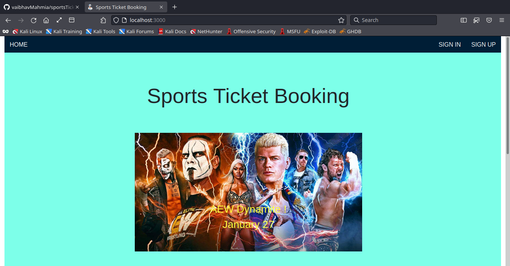
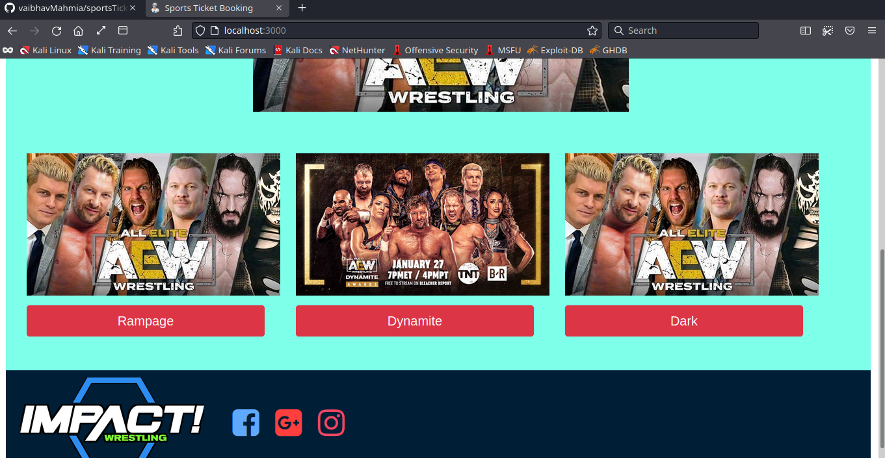
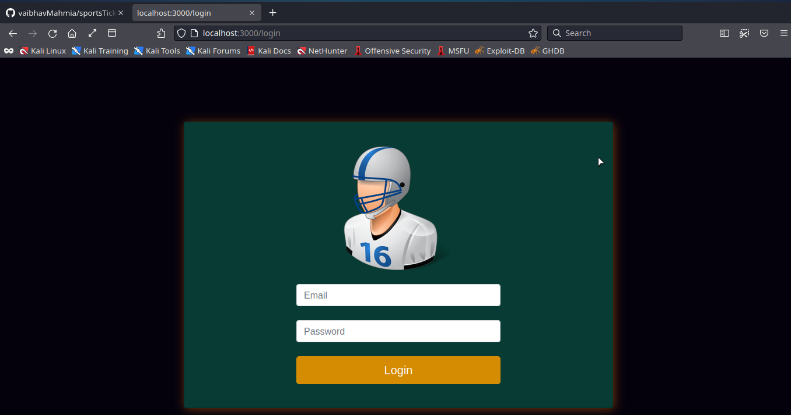
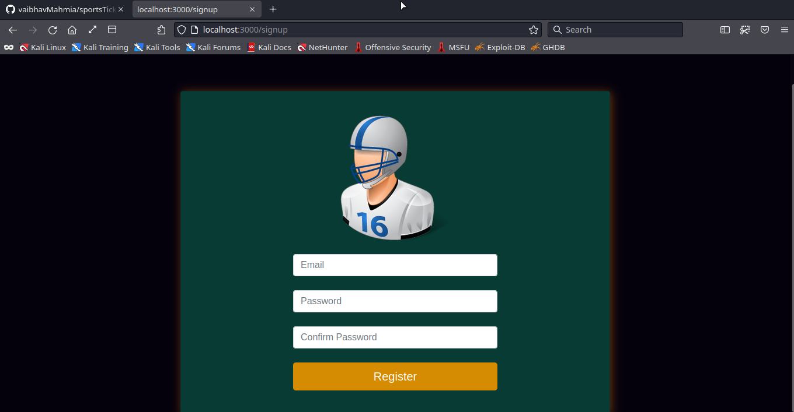
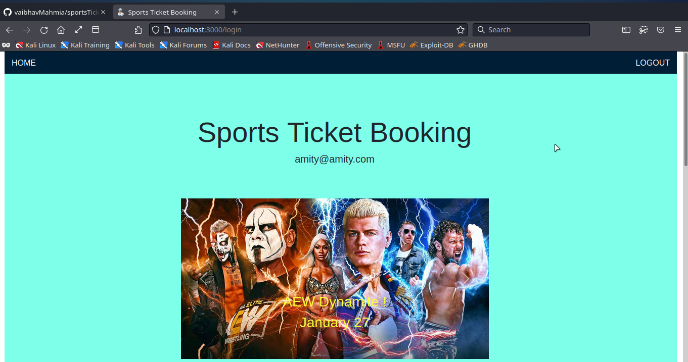
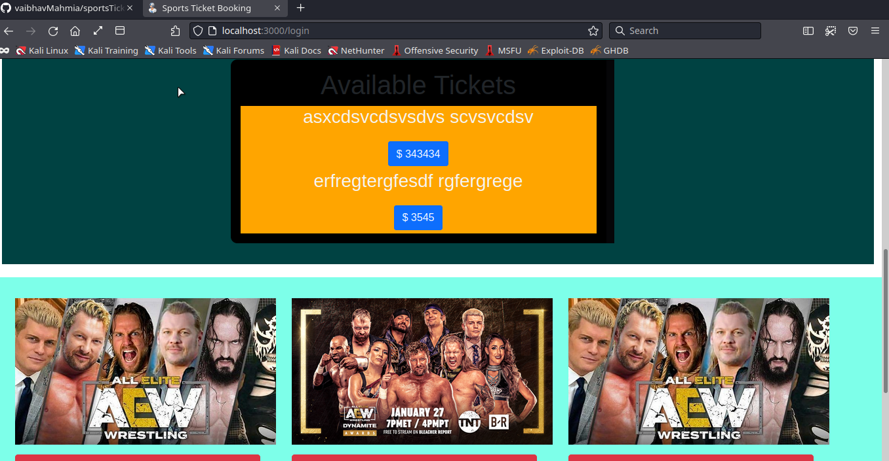
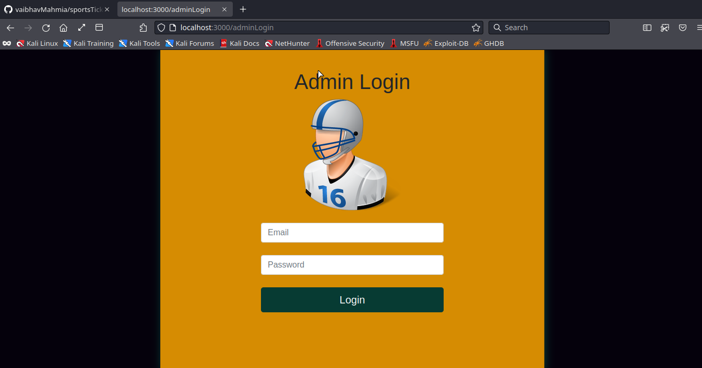
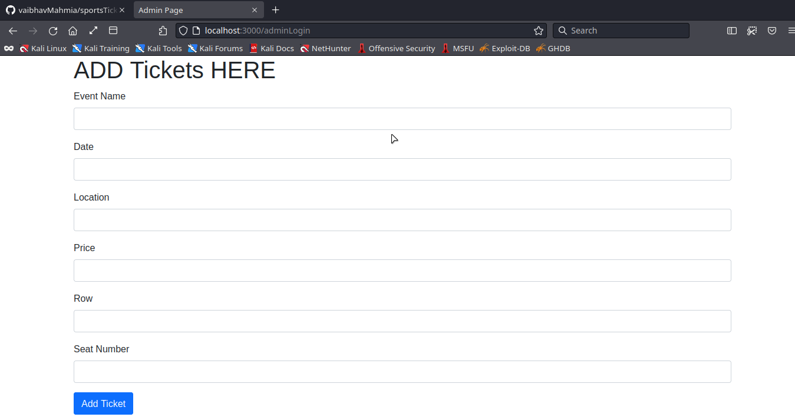

# Installation And Running 

## Installation
**=>** git clone https://github.com/vaibhavMahmia/sportsTicketBookingSystem \
**=>** cd sportsTicketBookingSystem \
**=>** npm install \

## Running
**=>** npm run dev \
now the server is running on http://localhost:3000 \

and dont forgot to start mongodb server or else it will give error \

### MongoDB should be installed
create a database named: sports-ticket

# Screenshots 

